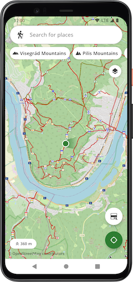
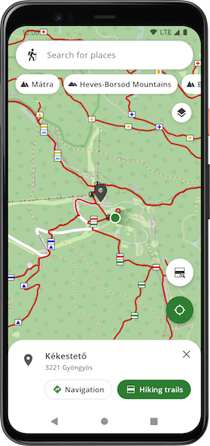
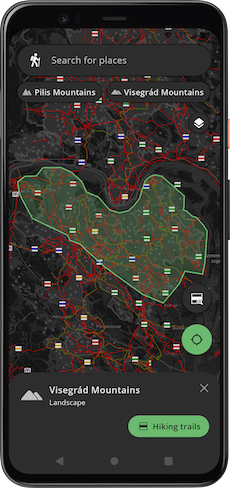

# HuKi - Hungarian Hiking Map #

HuKi is an Android app for hikers, which helps you plan trips and discover the hiking trails of
Hungary.

The app is available in Google Play and currently in open beta
stage: [HuKi Beta](https://play.google.com/store/apps/details?id=hu.mostoha.mobile.android.huki)

## Goals

The project was born for two primary reasons:

1. My personal entertainment - it's my beloved pet project in which I can try out Android stuff outside of my job.
2. It comes in handy for hikers to have trips in Hungary. No need to download tiles or setup layers
   manually.

The inspiration of the project
was [turistautak.openstreetmap.hu](https://turistautak.openstreetmap.hu/), I've been using their
webapp since I started hiking.

## Screenshots





## Graphhopper support

The route planner function is powered and supported by [Graphhopper](https://www.graphhopper.com/),
it uses the cloud version of the [Routing API](https://docs.graphhopper.com/#tag/Routing-API) for
creating navigation plans.

Huge thanks to the Graphhopper team for the opportunity!

### What is it good for

- Out-of-the-box integration with the Hungarian hiking trails
- Free-text search for places in OpenStreetMap databases
- Landscapes, routes-nearby function
- Current location monitoring with elevation support
- Route planner
- Importing and displaying routes from GPX files
- Dark mode support

### What is it NOT good for

- Custom layers with styles - [Locus](https://www.locusmap.app/), [OsmAnd](https://osmand.net/) are perfect choices for advanced layer customization.
- Recording hikes - Almost every fitness tracker/watch has its own functionality in this regard.
- Pre-recorded hike collection - [Természetjáró](https://www.termeszetjaro.hu/) for president.
- Community based hike sharing - [AllTrails](https://alltrails.com/), [Komoot](https://www.komoot.com/) etc.

## How does it work

- Tile render - [OsmDroid library](https://github.com/osmdroid/osmdroid)
- Base layers
  - [Mapnik](https://mapnik.org/)
  - [OpenTopo](https://opentopomap.org/)
  - [TuHu - turistautak.hu](https://turistautak.hu/)
- Hiking tiles - [TuraReteg.sqlitedb](https://data2.openstreetmap.hu/) privately hosted in an AWS S3
  bucket
- OpenStreetMap data provider - [Overpass API](https://wiki.openstreetmap.org/wiki/Overpass_API)
- Search engine - [Photon](https://photon.komoot.io/)
- Route planner - [Graphhopper Routing API](https://docs.graphhopper.com/#tag/Routing-API)
- Location service
  - [Google Fused Location Provider](https://developers.google.com/location-context/fused-location-provider)
    integrated with OsmDroid
- Hike recommendations
  - [Kirándulástippek](https://kirandulastippek.hu/) link with area tags like `"budai-hegyseg"`
  - [Természetjáró](https://www.termeszetjaro.hu/) link with search query parameter

### Tile server optimization

Since the hiking tiles are hosted in an AWS S3 bucket funded by me, I had to make some preliminary optimization to reduce the cost of the service.

1. The S3 bucket is only accessible by my app via `Amazon Amplify`
2. The hiking tiles are synced by `TuraReteg.sqlitedb` every month
3. The app uses a local [tile range map](app/src/main/res/raw/hiking_layer_tile_zoom_ranges.json) created by the `TuraReteg` database to avoid unnecessary requests of empty tiles
4. 14 days cache mechanism is applied by the `OsmDroid` tile renderer.
5. The app also caches the empty tiles (HTTP 404 responses also count as paid S3 requests)

In the future I may have to make additional changes or re-consider the current setup completely based on the server costs.

### Architecture

The project is my playground, and I don't like to be overly-attached to a specific architecture, but the currently used stack can be summarized by:

<table>
    <tr>
    <td><strong>Component</strong>
    </td>
    <td><strong>Responsibilities</strong>
    </td>
    <td><strong>Key classes</strong>
    </td>
    </tr>
    <tr>
    <td><code>Activity</code>
    </td>
    <td>The project currently contains a single screen without fragments or navigation.</td>
    <td><code>HomeActivity</code><br>
    </td>
    </tr>
    <tr>
    <td><code>ViewModel</code>
    </td>
    <td>It provides the data for the UI via multiple <code>StateFlow</code> streams (MVVM approach). It requests the data from the <code>Interactor</code> and maps domain models to UI models. </td>
    <td><code>HomeViewModel</code><br>
    </td>
    </tr>
    <tr>
    <td><code>Interactor</code>
    </td>
    <td>It converts direct <code>suspend</code>network calls to <code>Flow</code> streams and calls <code>Repository</code> functions.</td>
    <td><code>HikingLayerInteractor, LandscapeInteractor</code><br>
    </td>
    </tr>
    <tr>
    <td><code>Repository</code>
    </td>
    <td>Fetches the data through the network or local repository via <code>suspend</code> functions while mapping network models to domain models.</td>
    <td><code>OsmPlacesRepository, FileBasedHikingLayerRepository</code><br>
    </td>
    </tr>
</table>

## Integration & Delivery

The project uses `GitHub Actions` to ensure code quality and to automatically deploy to `Google Play Store`.

I'm a big fan of testing so the project is fairly covered with Unit and Instrumentation tests.

The following steps are running on the CI server on `master` push:

- Detekt
- Android lint
- Unit tests
- Instrumentation tests on Firebase Test Lab (using two devices with `minApi` and `targetApi`)
- Auto-versioning of the apks
- Release app signing
- Publishing to `Google Play Store` with release notes

### Release steps

- Update the release notes under [assets/GooglePlayStore/whatsnew](assets/GooglePlayStore/whatsnew)
- Create an annotated `TAG` with a final version like `v0.5`. The apk version is generated by [versions.gradle](buildscripts/versions.gradle)
- Push the code with tags

## Contributions

Since the project is still in its early stages, I would be happy to receive ideas, advices or even a code review :)

- If you've found a bug, please file an issue.
- PRs are more than welcome. Please keep an eye on the CI verification steps.
- If you want to be a contributor, please [reach out to me](mailto:roland.mostoha@gmail.com).

## External licenses

The app is built upon many `OpenStreetMap` related services. There is an in-app licences dialog that can be shown by clicking `© OpenStreetMap contributors` on the map view.

### Licence resources

- OpenStreetMap - https://www.openstreetmap.org/copyright
- Hungarian Hiking Layer (turistautak.openstreetmap.hu) - https://data2.openstreetmap.hu/
- Komoot - Photon (Search engine) - https://photon.komoot.io/
- OsmDroid - Tile render - https://github.com/osmdroid/osmdroid
- Graphhopper - Routing API - https://www.graphhopper.com/
- Kirándulástippek - Hike recommendation -  https://kirandulastippek.hu/
- Természetjáró - Hike recommendation -  https://www.termeszetjaro.hu/
- OKT - National Blue Trail -  https://www.kektura.hu/
- TuHu (turistautak.hu) - Base layer -  https://turistautak.hu/

## Project License

```
MIT License

Copyright (c) 2020-2023 Roland Mostoha

Permission is hereby granted, free of charge, to any person obtaining a copy
of this software and associated documentation files (the "Software"), to deal
in the Software without restriction, including without limitation the rights
to use, copy, modify, merge, publish, distribute, sublicense, and/or sell
copies of the Software, and to permit persons to whom the Software is
furnished to do so, subject to the following conditions:

The above copyright notice and this permission notice shall be included in all
copies or substantial portions of the Software.

THE SOFTWARE IS PROVIDED "AS IS", WITHOUT WARRANTY OF ANY KIND, EXPRESS OR
IMPLIED, INCLUDING BUT NOT LIMITED TO THE WARRANTIES OF MERCHANTABILITY,
FITNESS FOR A PARTICULAR PURPOSE AND NONINFRINGEMENT. IN NO EVENT SHALL THE
AUTHORS OR COPYRIGHT HOLDERS BE LIABLE FOR ANY CLAIM, DAMAGES OR OTHER
LIABILITY, WHETHER IN AN ACTION OF CONTRACT, TORT OR OTHERWISE, ARISING FROM,
OUT OF OR IN CONNECTION WITH THE SOFTWARE OR THE USE OR OTHER DEALINGS IN THE
SOFTWARE.
```
